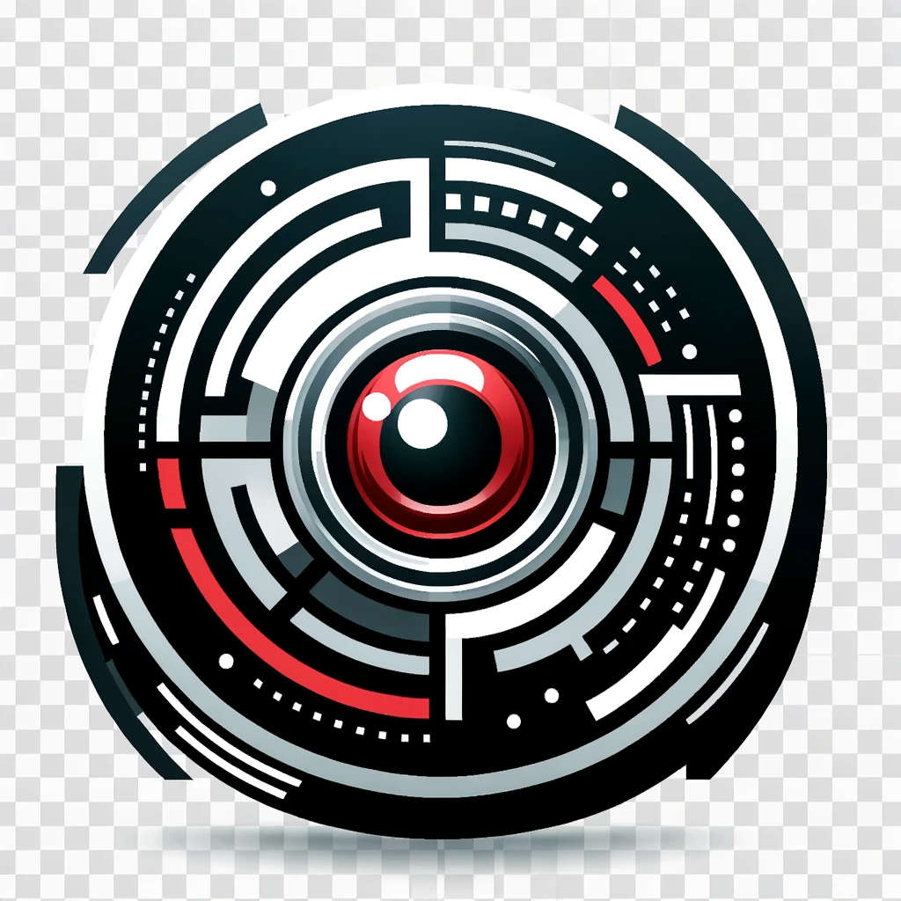

[![Contributors][contributors-shield]][contributors-url]
[![Forks][forks-shield]][forks-url]
[![Stargazers][stars-shield]][stars-url]
[![Issues][issues-shield]][issues-url]
[![MIT License][license-shield]][license-url]
[![LinkedIn][linkedin-shield]][linkedin-url]


<!-- PROJECT LOGO -->
<br />
<div align="center">
  <a href="https://github.com/pjmarz/HAL-9001">
    
  </a>

<h3 align="center">HAL-9001</h3>

  <p align="center">
  The next and final addition to your bar cart.
  <p align="center">
    <br />
    <a href="https://github.com/pjmarz/HAL-9001/wiki"><strong>Explore the docs »</strong></a>
    <br />
    <br />
    <a href="https://github.com/pjmarz/HAL-9001">View Demo</a>
    ·
    <a href="https://github.com/pjmarz/HAL-9001/issues">Report Bug</a>
    ·
    <a href="https://github.com/pjmarz/HAL-9001/issues">Request Feature</a>
  </p>
</div>


<!-- TABLE OF CONTENTS -->
<details>
  <summary>Table of Contents</summary>
  <ol>
    <li>
      <a href="#about-the-project">About The Project</a>
      <ul>
        <li><a href="#built-with">Built With</a></li>
      </ul>
    </li>
    <li>
      <a href="#getting-started">Getting Started</a>
      <ul>
        <li><a href="#prerequisites">Prerequisites</a></li>
        <li><a href="#installation">Installation</a></li>
      </ul>
    </li>
    <li><a href="#usage">Usage</a></li>
    <li><a href="#roadmap">Roadmap</a></li>
    <li><a href="#contributing">Contributing</a></li>
    <li><a href="#license">License</a></li>
    <li><a href="#contact">Contact</a></li>
    <li><a href="#acknowledgments">Acknowledgments</a></li>
  </ol>
</details>


<!-- ABOUT THE PROJECT -->
## About The Project

[![Product Name Screen Shot][product-welcome]](https://github.com/pjmarz/HAL-9001)

 <p align="left">
  Welcome to HAL-9001, a system dedicated to cataloging and interpreting information from liquor and spirit bottles. By leveraging advanced imaging technology paired with the analytical capabilities of OpenAI's ChatGPT, HAL-9001 offers a sophisticated way to identify and organize data about various spirits.   
  <p align="left">
  HAL-9001 employs a high-resolution camera to capture detailed images of liquor bottles. It then utilizes AI to analyze these images and extract valuable data such as the brand, model, alcohol by volume (ABV), and suggested retail price. This process enables users to easily manage and access information about their liquor collections.
  <p align="left">
  Technically speaking, HAL-9001 is built with JavaScript for an engaging and responsive user experience on the frontend. The backend, developed with Python, efficiently processes and stores data, ensuring reliability and performance.
  <p align="left">
  PHAL-9001 is the go-to solution for effortless management of your spirit inventory.


<!-- GETTING STARTED -->
## Getting Started

This is an example of how you may give instructions on setting up your project locally.
To get a local copy up and running follow these simple example steps.

### Prerequisites

This is an example of how to list things you need to use the software and how to install them.
* npm
  ```sh
  npm install npm@latest -g
  ```

### Installation

1. Get a free API Key at [https://example.com](https://example.com)
2. Clone the repo
   ```sh
   git clone https://github.com/github_username/repo_name.git
   ```
3. Install NPM packages
   ```sh
   npm install
   ```
4. Enter your API in `config.js`
   ```js
   const API_KEY = 'ENTER YOUR API';
   ```


<!-- USAGE EXAMPLES -->
## Usage

Use this space to show useful examples of how a project can be used. Additional screenshots, code examples and demos work well in this space. You may also link to more resources.

_For more examples, please refer to the [Documentation](https://github.com/pjmarz/HAL-9001/wiki)_


<!-- ROADMAP -->
## Roadmap

- [ ] Feature 1
- [ ] Feature 2
- [ ] Feature 3
    - [ ] Nested Feature

See the [open issues](https://github.com/pjmarz/HAL-9001/issues) for a full list of proposed features (and known issues).


### Built With

[![Next.js][Next.js]][Next.js-url]
[![Python][Python]][Python-url]


<!-- CONTRIBUTING -->
## Contributing

Contributions are what make the open source community such an amazing place to learn, inspire, and create. Any contributions you make are **greatly appreciated**.

If you have a suggestion that would make this better, please fork the repo and create a pull request. You can also simply open an issue with the tag "enhancement".
Don't forget to give the project a star! Thanks again!

1. Fork the Project
2. Create your Feature Branch (`git checkout -b feature/AmazingFeature`)
3. Commit your Changes (`git commit -m 'Add some AmazingFeature'`)
4. Push to the Branch (`git push origin feature/AmazingFeature`)
5. Open a Pull Request


<!-- LICENSE -->
## License

Distributed under the MIT License. See `LICENSE.txt` for more information.


<!-- CONTACT -->
## Contact

Peter Marino - [linktree](https://linktr.ee/pjmarz)

<!-- Project Link: [https://github.com/pjmarz/HAL-9001](https://github.com/pjmarz/HAL-9001) -->


<!-- ACKNOWLEDGMENTS -->
## Acknowledgments

* []()
* []()
* []()


<!-- MARKDOWN LINKS & IMAGES -->
<!-- https://www.markdownguide.org/basic-syntax/#reference-style-links -->
[contributors-shield]: https://img.shields.io/github/contributors/pjmarz/HAL-9001.svg?style=for-the-badge
[contributors-url]: https://github.com/pjmarz/HAL-9001/graphs/contributors
[forks-shield]: https://img.shields.io/github/forks/pjmarz/HAL-9001.svg?style=for-the-badge
[forks-url]: https://github.com/pjmarz/HAL-9001/network/members
[stars-shield]: https://img.shields.io/github/stars/pjmarz/HAL-9001.svg?style=for-the-badge
[stars-url]: https://github.com/pjmarz/HAL-9001/stargazers
[issues-shield]: https://img.shields.io/github/issues/pjmarz/HAL-9001.svg?style=for-the-badge
[issues-url]: https://github.com/pjmarz/HAL-9001/issues
[license-shield]: https://img.shields.io/github/license/pjmarz/HAL-9001.svg?style=for-the-badge
[license-url]: https://github.com/pjmarz/HAL-9001/blob/main/LICENSE.txt
[linkedin-shield]: https://img.shields.io/badge/-LinkedIn-black.svg?style=for-the-badge&logo=linkedin&colorB=555
[linkedin-url]: https://linkedin.com/in/pjmarz/
[product-welcome]: images/welcome.png
[Next.js]: https://img.shields.io/badge/next.js-grey?style=for-the-badge&logo=next.js
[Next.js-url]: https://nextjs.org/
[Python]: https://img.shields.io/badge/python-000000?style=for-the-badge&logo=python
[Python-url]: https://www.python.org/