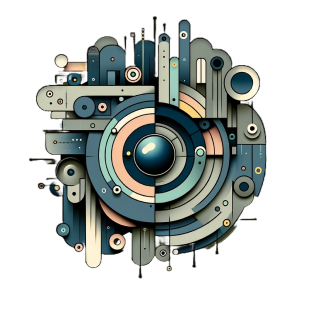

<!-- PROJECT LOGO -->
<br />
<div align="center">
  <a href="https://github.com/pjmarz/HAL-9001">
    
  </a>

<h3 align="center">HAL-9001</h3>

  <p align="center">
    Your AI-Powered Bar Cart Management System
    <br />
    <a href="https://github.com/pjmarz/HAL-9001/wiki"><strong>Explore the docs »</strong></a>
    <br />
    <br />
    <a href="https://github.com/pjmarz/HAL-9001/issues">Report Bug</a>
    ·
    <a href="https://github.com/pjmarz/HAL-9001/issues">Request Feature</a>
  </p>
</div>

[![Contributors][contributors-shield]][contributors-url]
[![Forks][forks-shield]][forks-url]
[![Stargazers][stars-shield]][stars-url]
[![PullRequest][pullrequest-shield]][pullrequest-url]
[![Issues][issues-shield]][issues-url]
[![MIT License][license-shield]][license-url]


<!-- TABLE OF CONTENTS -->
<!-- <details>
  <summary>Table of Contents</summary>
  <ol>
    <li>
      <a href="#about-the-project">About The Project</a>
      <ul>
        <li><a href="#built-with">Built With</a></li>
      </ul>
    </li>
    <li>
      <a href="#getting-started">Getting Started</a>
      <ul>
        <li><a href="#prerequisites">Prerequisites</a></li>
        <li><a href="#installation">Installation</a></li>
      </ul>
    </li>
    <li><a href="#usage">Usage</a></li>
    <li><a href="#roadmap">Roadmap</a></li>
    <li><a href="#contributing">Contributing</a></li>
    <li><a href="#license">License</a></li>
    <li><a href="#contact">Contact</a></li>
    <li><a href="#acknowledgments">Acknowledgments</a></li>
  </ol>
</details> -->


<!-- ABOUT THE PROJECT -->
## About The Project

[![Product Name Screen Shot][product-welcome]](https://github.com/pjmarz/HAL-9001)

HAL-9001 is a cutting-edge system that revolutionizes how you manage your spirits collection. By combining advanced imaging technology with AI-powered analysis, it offers an intelligent solution for cataloging and organizing your bar cart.

### Key Features

- 📸 **Smart Image Recognition**: Capture bottle images with high-resolution camera integration
- 🤖 **AI-Powered Analysis**: Leverages OpenAI's ChatGPT for intelligent data extraction
- 📊 **Comprehensive Data Collection**: Automatically extracts:
  - Brand and model information
  - Alcohol by volume (ABV)
  - Suggested retail price
  - Bottle details and characteristics
- 📱 **Modern User Interface**: Built with React for a seamless user experience
- 🔄 **Real-time Processing**: Efficient Node.js backend for quick data processing

### Built With

- [![React][React]][React-url] - Frontend framework
- [![Node.js][Node.js]][Node.js-url] - Backend runtime
- OpenAI ChatGPT - AI analysis
- High-resolution imaging system

## Getting Started

Follow these steps to set up HAL-9001 locally.

### Prerequisites

- Node.js (v14 or higher)
- npm
  ```sh
  npm install npm@latest -g
  ```
- A compatible camera system
- OpenAI API key

### Installation

1. Clone the repository
   ```sh
   git clone https://github.com/pjmarz/HAL-9001.git
   ```
2. Install NPM packages
   ```sh
   cd HAL-9001
   npm install
   ```
3. Configure your environment variables
   ```sh
   cp .env.example .env
   ```
4. Enter your API keys in `.env`
   ```
   OPENAI_API_KEY=your_api_key_here
   ```

## Usage

1. Start the application
   ```sh
   npm start
   ```
2. Open your browser and navigate to `http://localhost:3000`
3. Follow the on-screen instructions to:
   - Set up your camera
   - Capture bottle images
   - View and manage your collection

## Design

Check out our [Figma Design](https://www.figma.com/file/tZgf4bbk0TsXYaUsz28yWK/Hal-9001?type=design&node-id=0%3A1&mode=design&t=kABJrifNiPMdgAby-1) to see the UI/UX planning and design system.

## Roadmap

- [ ] Multi-bottle scanning
- [ ] Mobile app development
- [ ] Cocktail recipe recommendations
- [ ] Inventory tracking system
- [ ] Social sharing features

See the [open issues](https://github.com/pjmarz/HAL-9001/issues) for a full list of proposed features and known issues.

## Contributing

Contributions make the open source community an amazing place to learn, inspire, and create. Any contributions you make are **greatly appreciated**.

1. Fork the Project
2. Create your Feature Branch (`git checkout -b feature/AmazingFeature`)
3. Commit your Changes (`git commit -m 'Add some AmazingFeature'`)
4. Push to the Branch (`git push origin feature/AmazingFeature`)
5. Open a Pull Request

## License

Distributed under the MIT License. See `LICENSE.txt` for more information.

## Contact

Peter Marino - [@pjmarz](https://twitter.com/pjmarz) - petermarino2@gmail.com

Project Link: [https://github.com/pjmarz/HAL-9001](https://github.com/pjmarz/HAL-9001)

<!-- MARKDOWN LINKS & IMAGES -->
<!-- https://www.markdownguide.org/basic-syntax/#reference-style-links -->
[contributors-shield]: https://img.shields.io/github/contributors/pjmarz/HAL-9001.svg?style=for-the-badge
[contributors-url]: https://github.com/pjmarz/HAL-9001/graphs/contributors
[forks-shield]: https://img.shields.io/github/forks/pjmarz/HAL-9001.svg?style=for-the-badge
[forks-url]: https://github.com/pjmarz/HAL-9001/network/members
[stars-shield]: https://img.shields.io/github/stars/pjmarz/HAL-9001.svg?style=for-the-badge
[stars-url]: https://github.com/pjmarz/HAL-9001/stargazers
[pullrequest-shield]: https://img.shields.io/github/issues-pr-raw/pjmarz/HAL-9001?style=for-the-badge
[pullrequest-url]: https://github.com/pjmarz/HAL-9001/pulls
[issues-shield]: https://img.shields.io/github/issues/pjmarz/HAL-9001.svg?style=for-the-badge
[issues-url]: https://github.com/pjmarz/HAL-9001/issues
[license-shield]: https://img.shields.io/github/license/pjmarz/HAL-9001.svg?style=for-the-badge
[license-url]: https://github.com/pjmarz/HAL-9001/blob/main/LICENSE.txt
[linkedin-shield]: https://img.shields.io/badge/-LinkedIn-black.svg?style=for-the-badge&logo=linkedin&colorB=555
[linkedin-url]: https://linkedin.com/in/pjmarz/
[product-welcome]: images/welcome.png
[React]: https://img.shields.io/badge/react-grey?style=for-the-badge&logo=react
[React-url]: https://react.dev/
[Node.js]: https://img.shields.io/badge/node.js-000000?style=for-the-badge&logo=node.js
[Node.js-url]: https://nodejs.org/en